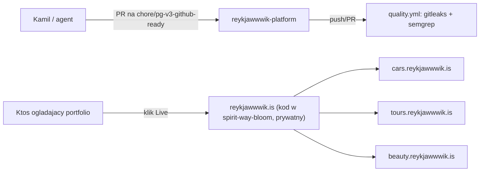

# ARCHITECTURE — reykjawwwik-platform

## Co to jest (3 zdania)

To repo NIE zawiera aplikacji — to publiczna wizytówka/referencja dla platformy SaaS Reykjawwwik
(agencja web/design, wycena wielorynkowa, CRM, generowanie umów PDF), której kod jest prywatny.
Płaci/korzysta agencja Reykjawwwik (MAS Group); repo istnieje, żeby portfolio/audyt mogły
wskazać na coś konkretnego bez ujawniania cennika, umów czy danych klientów.

## Stack tego repo (nie platformy)

Zero zależności. Same pliki Markdown + workflow GitHub Actions — jak w `README.md`.

## Co wiadomo o żywej platformie (publicznie, bez zaglądania w kod)

Z README (zweryfikowane `curl` -> 200 na `reykjawwwik.is`,
`cars.reykjawwwik.is`, `tours.reykjawwwik.is`, `beauty.reykjawwwik.is`): silnik cenowy
wielorynkowy (10 krajów, geo-detekcja), pipeline lead-do-umowy z CRM, generowanie umów PDF
z logiką VAT per kraj, powiadomienia push. Stack deklarowany w README: React, TypeScript,
Supabase, Vercel — **ten agent nie miał dostępu do kodu w
[`spirit-way-bloom`](https://github.com/kamiljan11/spirit-way-bloom) (zweryfikowane: 404 bez
autoryzacji, czyli faktycznie prywatne), więc powyższe to informacja z README platformy, nie
zweryfikowany fakt z kodu**. Szczegóły implementacji (schemat danych, logika VAT per kraj,
struktura CRM) [NIEPEWNE — nie widoczne z tego repo].

## Przepływ (to repo, nie platforma)

## Gdzie jest…

- **kod aplikacji**: nie w tym repo — w `spirit-way-bloom` (prywatne, patrz README), poza
  zasięgiem tego audytu
- **dowod, ze platforma zyje**: `docs/RUNBOOK.md` (curl na 4 domeny)
- **decyzja o rozdziale repo publiczne / kod prywatny**: `docs/adr/0001-public-repo-is-a-reference-not-the-source.md`

## Decyzje nieodwracalne

Lista ADR: `docs/adr/`.

## Jak to cofnąć / kill switch

Nie dotyczy — ten repo nie steruje niczym w produkcji, to wyłącznie dokumentacja.
